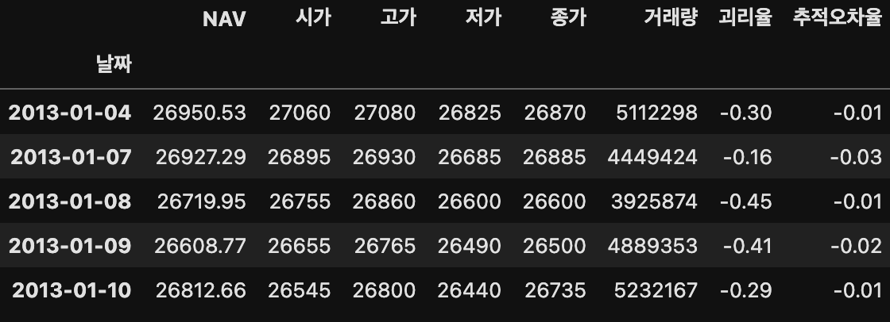
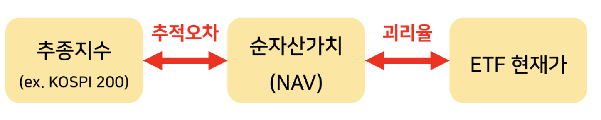

# Stock Market Prediction Project

> 딥러닝 LSTM과 Transformer를 활용한 ETF 수익률 예측성 분석 프로젝트
> 

- Data
    - KOSPI200 지수 추종 ETF KODEX200
    - 2013-01-04 ~ 2023-01-04
    - NAV, 시가, 고가, 저가, 종가, 거래량, 괴리율, 추적오차율
    
    
    
- ETF
